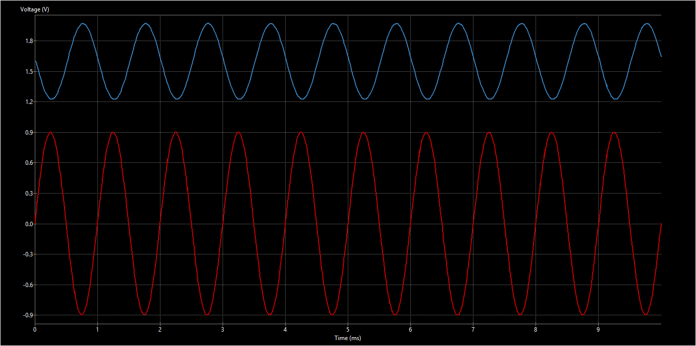
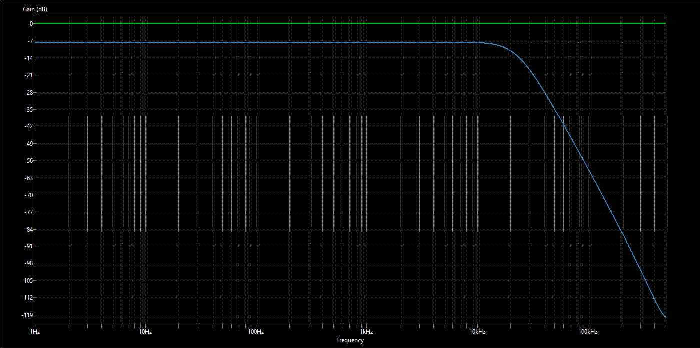
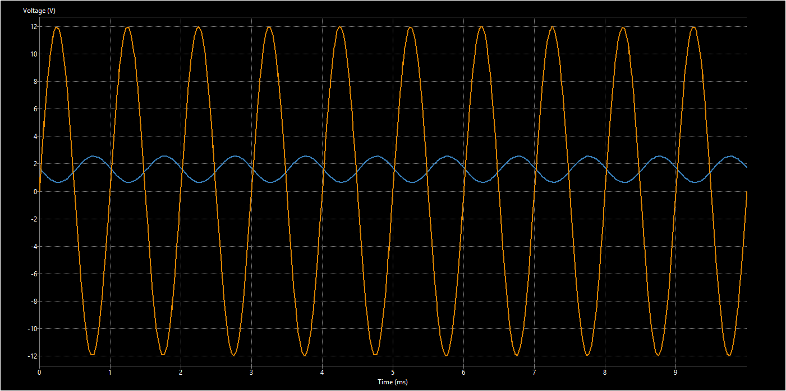
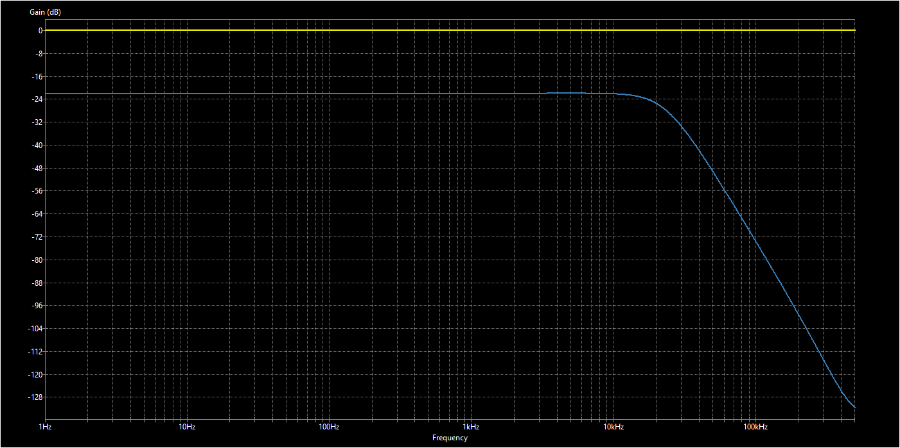

# Audio Signal Chain Simulation

## Trace Legend

| Color  | Signal |
|--------|--------|
| Red    | Time Domain RCA Audio Signal (1.8Vpp) |
| Green  | Frequency Domain RCA Audio Signal |
| Blue   | Time/Frequency Domain ADC Audio Signal |
| Orange | Time Domain Speaker Level Audio Signal (12Vpp) |
| Yellow | Frequency Domain Speaker Level Audio Signal |

## RCA Input

### Time Domain

### Frequency Domain

## Speaker Level Input

### Time Domain

### Frequency Domain

All sims were run with digipot code = 128 (wiper -> midpoint), meaning the PGAs are not attenuating or amplifying the signal at all, merely inverting

The signal chain employs the following vendor spice models:
* BAT54SW.lib
* MCP4451.lib
* MCP6021_MCP6024.lib
* MCP6N11.lib
* REF35.lib
* SD15C.lib
* TS3A24159.lib